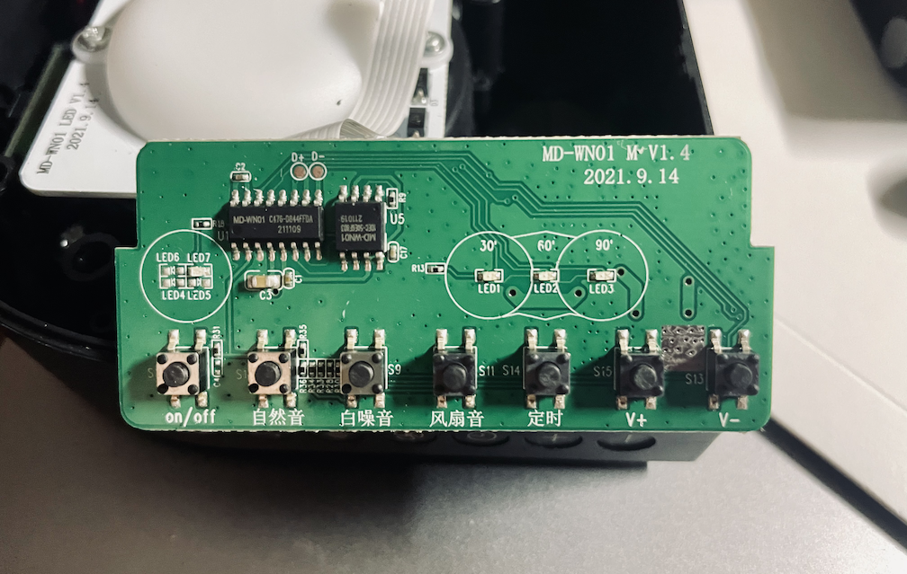
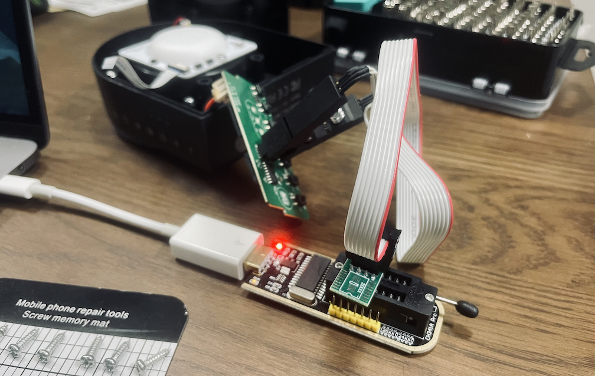

I recently bought a [Medcursor White Noise Machine][md-wn01] in a desperate attempt to help my newborn son sleep longer through the night. At about ¥2,500 on Amazon, it's a fairly affordable and sleek device that I'd have no problems recommending.

Unfortunately, I'm really into the sound of rain and thunder and this particular device only comes with a single matching track... Additionally, the rain is quiet while the thunder is loud — a bad mix when you're trying not to startle a sleeping baby.

How are we going to fix this problem? Let's hack it.

## Reconnaissance

To start with, getting this thing open is like dealing with the [Lament Configuration][lament-configuration]. It turns out that the speaker grille hides the screws, and luckily it's not glued in place. Once you slide it off and remove the screws it's simply a matter of prying the shell apart (which is easier said than done).

Inside the unit is a fairly simple multi-PCB design. The main circuit board that we care about is fitted on the side of the machine, aligned with the buttons.



Unfortunately, a lot of the ICs on this device have no usable markings, so it's difficult to identify what is what. The 8-pin SOIC labeled `U5` is a good candidate for a flash chip, so let's start there. I connected a CH341A programmer to the chip with a SOIC-8 test clip and gave it a whirl with `flashrom`.

```noLineNumbers
$ flashrom --programmer ch341a_spi -r dump.bin
flashrom v1.2 on Darwin 21.5.0 (x86_64)
flashrom is free software, get the source code at https://flashrom.org

Calibrating delay loop... OK.
Found Generic flash chip "unknown SPI chip (RDID)" (0 kB, SPI) on ch341a_spi.
===
This flash part has status NOT WORKING for operations: PROBE READ ERASE WRITE
The test status of this chip may have been updated in the latest development
version of flashrom. If you are running the latest development version,
please email a report to flashrom@flashrom.org if any of the above operations
work correctly for you with this flash chip. Please include the flashrom log
file for all operations you tested (see the man page for details), and mention
which mainboard or programmer you tested in the subject line.
Thanks for your help!
Read is not working on this chip. Aborting.
```

Hmm, no luck. It would have been nice for it to work on the first go, but it seems this is some unsupported generic chip. Running the above command again with the `-VVV` flag gives us some more info.

```noLineNumbers
$ flashrom --programmer ch341a_spi -r dump.bin -VVV
...
RDID returned 0xd8 0x40 0x18. RDID byte 0 parity violation
probe_spi_rdid_generic: id1 0xd8, id2 0x4018
...
```

Now we're getting somewhere. When asked for an RDID, the chip is returning `0xD8` for id1 and `0x4018` for id2. `0xD8` is actually an invalid manufacturer ID (as shown by the parity violation warning), so we have even more evidence that this chip is not made by a well-known vendor. The device ID is interesting though since it matches the relatively popular [W25Q128FV][w25q128fv] flash chip by Winbond. Just a coincidence, or something more?

## White Lies

If we were to assume that our unknown chip was mostly identical to the Winbond W25Q128FV, then we could simply edit the source of `flashrom` and force it to recognize them as one and the same.

```c:title=flashchips.h noLineNumbers {5}
/*
 * W25X chips are SPI, first byte of device ID is memory type, second
 * byte of device ID is related to log(bitsize).
 */
#define WINBOND_NEX_ID        0xD8   /* Winbond (ex Nexcom) serial flashes */
#define WINBOND_NEX_W25Q128_V 0x4018 /* W25Q128BV; W25Q128FV in SPI mode (default) */
```

Modifying the Winbond manufacturer ID constant to match `0xD8` will ensure that our generic chip is forcibly recognized as the W25Q128FV. After recompiling it, we just need to try another read with the freshly built custom `flashrom` binary.

```noLineNumbers {10}
$ CONFIG_RAYER_SPI=no CONFIG_ENABLE_LIBPCI_PROGRAMMERS=no make
...
make[1]: Nothing to be done for `all'.

$ ./flashrom --programmer ch341a_spi -r dump.bin
flashrom v1.2 on Darwin 21.5.0 (x86_64)
flashrom is free software, get the source code at https://flashrom.org

Calibrating delay loop... OK.
Found Winbond flash chip "W25Q128.V" (16384 kB, SPI) on ch341a_spi.
Reading flash... done.
```

## Resampling

Nice! We've successfully dumped the contents of the flash chip. Now let's figure out what we've got. If you run `file` on the dump, you'll see we have a FAT16 formatted image.

```noLineNumbers
$ file dump.bin
dump.bin: DOS/MBR boot sector, code offset 0x3c+2, OEM-ID "MSDOS5.0",
sectors/cluster 32, reserved sectors 4, root entries 512, Media descriptor
0xf8, sectors/FAT 30, sectors/track 63, heads 255, hidden sectors 32, sectors
243680 (volumes > 32 MB), serial number 0xd2e006c3, unlabeled, FAT (16 bit)
```

On macOS, you can actually just give the dump a `.img` extension, double click on it, and the image will be mounted and writable. If you're okay with modifying the image in place, then it's a quick and simple approach.

The image itself is filled with 29 MP3 files. Now comes the hard part; finding some suitable sound samples that seamlessly loop. [freesound.org][freesound] is a good place to go hunting. I was lucky in that all the loops I found managed to fit within the image without any resizing. Of course, you could make it a bit bigger if needed (remember though, we don't have any hard evidence about the true capacity of the flash chip).

Now you just need to write it back!



## Final Thoughts

I hope you were able to get something out of this post! I didn't get into the nitty-gritty of how to do things, and that's mainly because I wanted this to be more of a demonstration than a tutorial. Hopefully, you can see that hacking consumer electronics can (sometimes) be incredibly easy! In this case, I was able to take an already decent product and further customize it to suit my personal needs. Make your purchases work for you, there's no need to settle for what came out of the box.

Could I have just bought a Bluetooth speaker and streamed [YouTube][youtube] to it? Sure, but where's the fun in that?

[md-wn01]: https://medcursor.com/products/white-noise-machine-black
[lament-configuration]: https://hellraiser.fandom.com/wiki/Lament_Configuration
[w25q128fv]: https://www.winbond.com/hq/product/code-storage-flash-memory/serial-nor-flash/?__locale=en&partNo=W25Q128FV
[freesound]: https://freesound.org/
[youtube]: https://www.youtube.com/watch?v=mPZkdNFkNps
