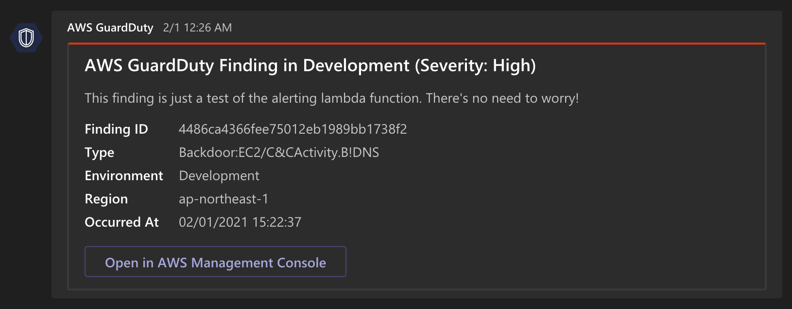

[AWS GuardDuty][guardduty] is a managed threat detection service that monitors malicious or unauthorized behaviors/activities related to AWS resources. Effectively it can be set up to act similarly to an IDS, providing a stream of *findings* that can clue security analysts in on potential threats.

Of course, exclusively reviewing these events through the AWS Console somewhat defeats their purpose... By the time you've logged in and seen that six-hour-old high severity finding, the threat has already had enough time to cause its intended damage.

One reasonable solution is to forward those events to a more visible channel. In this post, I'll demonstrate how you can utilize AWS services like Lambda and CloudWatch to pass these GuardDuty findings onto a communication tool like [Microsoft Teams][microsoft-teams].



## Anatomy of a Finding

Each GuardDuty finding is associated with a large number of useful [details][finding-details], often dependent on the type of the finding itself. These details include attributes like the name and severity of the finding, the region it occurred in, and the time it was last detected. The *severity* of a finding is particularly interesting, providing us with a simple metric indicating importance. AWS defines severity levels using three distinct ranges:

| Severity Level | Value Range |
| -------------- | ----------- |
| High           | 7.0 – 8.9   |
| Medium         | 4.0 – 6.9   |
| Low            | 0.1 – 3.9   |

As an example of how this could be used, we could filter out *particularly* unimportant findings by ignoring anything with a severity less than 2.0.

## CloudWatch and Lambda

[AWS CloudWatch][cloudwatch] helpfully provides us with a **GuardDuty Finding** event type for rules. Using this, we can easily have CloudWatch trigger a Lambda function for processing each finding. In terms of a Terraform resource, it could be represented as follows:

```hcl {14-24}
resource "aws_cloudwatch_event_rule" "forward_finding_rule" {
  name        = "forward-guardduty-finding-to-teams"
  description = "Triggers a lambda function whenever a GuardDuty finding is updated."

  event_pattern = <<EOF
{
  "source": [
    "aws.guardduty"
  ],
  "detail-type": [
    "GuardDuty Finding"
  ],
  "detail": {
    "severity": [
      0.1, 0.2, 0.3, 0.4, 0.5, 0.6, 0.7, 0.8, 0.9, 1, 1.0,
      1.1, 1.2, 1.3, 1.4, 1.5, 1.6, 1.7, 1.8, 1.9, 2, 2.0,
      2.1, 2.2, 2.3, 2.4, 2.5, 2.6, 2.7, 2.8, 2.9, 3, 3.0,
      3.1, 3.2, 3.3, 3.4, 3.5, 3.6, 3.7, 3.8, 3.9, 4, 4.0,
      4.1, 4.2, 4.3, 4.4, 4.5, 4.6, 4.7, 4.8, 4.9, 5, 5.0,
      5.1, 5.2, 5.3, 5.4, 5.5, 5.6, 5.7, 5.8, 5.9, 6, 6.0,
      6.1, 6.2, 6.3, 6.4, 6.5, 6.6, 6.7, 6.8, 6.9, 7, 7.0,
      7.1, 7.2, 7.3, 7.4, 7.5, 7.6, 7.7, 7.8, 7.9, 8, 8.0,
      8.1, 8.2, 8.3, 8.4, 8.5, 8.6, 8.7, 8.8, 8.9
    ]
  }
}
EOF
}
```

Note that the ugly block of severity levels is an unfortunate requirement of CloudWatch's design. If a finding comes through with a severity that isn't explicitly listed above, it won't be forwarded to the Lambda function...

Now onto the fun part. We can create an [AWS Lambda][lambda] function using any of the available languages. I'm going to use the **Python 3.8** runtime because I think Python is perfect for these sorts of small stand-alone functions.

```py {2,4-5}
def lambda_handler(event: Dict[str, Any], context: Any) -> None:
    event_detail = event["detail"]

    if event_detail["severity"] < 2.0:
        return

    card = create_card(event_detail)
    send_card(card)
```

We can get the above-described finding details out of the handler's `event` parameter, as shown on line 2. This sub-dictionary contains all the information we need to filter on the severity and pass the finding onto Teams. In the example I've provided, I'm passing the details to a `create_card(event_detail)` function to encode the message in a way Teams will understand. The result of this call is a dictionary that can be *jsonified* and sent to a Teams webhook:

```json
{
  "@type": "MessageCard",
  "@context": "https://schema.org/extensions",
  "correlationId": "ed63439c-8efd-44af-847a-a15f3822cf92",
  "summary": "A summary of the message.",
  "themeColor": "9B59B6",
  "title": "Message Title",
  "sections": [
    {
      "facts": [
        {"name": "Finding ID", "value": "db49b33c711d380d2717e5bb7165e644"},
        {"name": "Type", "value": "Canary:EC2/Stateless.IntegTest"},
        {"name": "Environment", "value": "Development"},
        {"name": "Region", "value": "us-east-1"},
        {"name": "Occurred At", "value": "2017-10-31T23:16:23.824Z"}
      ],
      "text": "A detailed description of the finding."
    }
  ],
  "potentialAction": [
    {
      "@type": "OpenUri",
      "name": "Open in AWS Management Console",
      "targets": [
        {
          "os": "default",
          "uri": "https://us-east-1.console.aws.amazon.com/..."
        }
      ]
    }
  ]
}
```

## Now What?

At this point, we've got a Lambda function that we can do practically anything with. You could easily modify the example function I've written to post to other communication tools like Slack or to an incident response service like PagerDuty. You could even do something out there and automate your home lighting to match the severity of incoming events...


You can find a nicely packaged version of all this code in my [GitHub repository][repository]. It includes a [Terraform][terraform] configuration, so you can get everything up and running for your organization within a couple of commands.

[cloudwatch]: https://aws.amazon.com/cloudwatch/
[finding-details]: https://docs.aws.amazon.com/guardduty/latest/ug/guardduty_findings-summary.html
[guardduty]: https://aws.amazon.com/guardduty/
[lambda]: https://aws.amazon.com/lambda/
[microsoft-teams]: https://www.microsoft.com/en/microsoft-teams/group-chat-software
[repository]: https://github.com/lbm/terraform-aws-guardduty-teams
[terraform]: https://www.terraform.io
