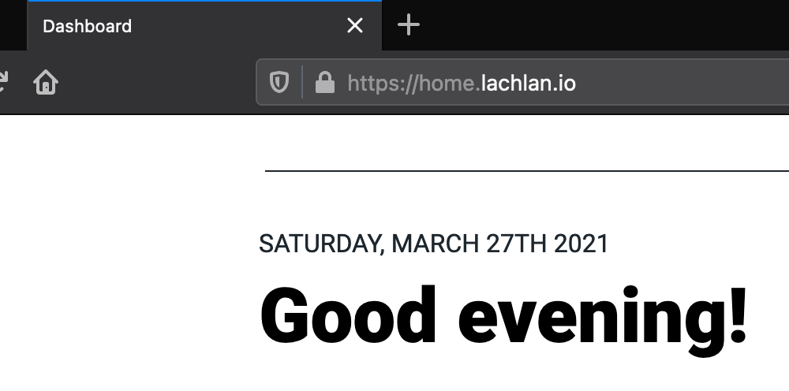

[K3s][k3s] is a lightweight Kubernetes distribution built for the purposes of IoT and Edge computing. Recently, I decided to use it as the basis for all my self-hosted services. My goal was to set up a Kubernetes distribution that would run well across a bunch of ARM64 compute modules. As is standard for me, I decided to over-engineer it and ensure that my home network was as "enterprisey" as humanely possible.

A big part of this was making sure that all my services were strictly available over HTTPS (via private subdomains of [lachlan.io][lachlan-io]). A tool like [cert-manager][cert-manager] can be used to automatically issue regular TLS certificates, but I wasn't satisfied with the fact that my internal domain names would be leaked via publicly available *certificate transparency logs*.

As an example, take a look at the logs for my domain: https://crt.sh/?q=lachlan.io. In that list, you'll see `home.lachlan.io`, a certificate I initially issued for one of my internally hosted services. That record will remain publicly available *forever*, leaking private information about which services I'm using. On the other hand, a wildcard certificate like `*.lachlan.io` leaks nothing more than the fact that I'm using any number of subdomains.

In this post, I will describe how I used cert-manager to configure a default wildcard certificate for K3's inbuilt Traefik ingress controller.

<blockquote style="background: #fd01; border-left-color: #fd0; padding: 1px 2rem;">
  <h5><em>Warning</em></h5>

  <p style="font-style: normal;">Careful consideration must be applied when using wildcard TLS certificates. If a server holding the private key for a wildcard certificate is compromised, then the confidentiality and integrity of <em>all</em> traffic to <em>all</em> other servers using the certificate will also be compromised. On the other hand, the compromise of a regular TLS certificate only affects the one subdomain, significantly lowering the blast radius of an event.</p>

  <p style="font-style: normal;">As a general rule of thumb, you probably shouldn't be using a wildcard certificate unless you have one of the following requirements:</p>
  <ol>
    <li>You don't want your subdomains showing up in certificate transparency logs.</li>
    <li>You're issuing for so many subdomains that certificate providers are rate-limiting you.</li>
  </ol>
</blockquote>

## Preparing the Cluster

Deploying the actual K3s cluster is out of the scope of this article, so please use the official [quick-start guide][k3s-quick-start] if needed. Once your cluster is up and running, the first step will be to install cert-manager. You can do this by `kubectl` applying regular manifests, but I'm partial to using helm charts wherever possible:

```bash
# Create the namespace for cert-manager
kubectl create namespace cert-manager
# Add the Jetstack Helm repository and update your local cache
helm repo add jetstack https://charts.jetstack.io && helm repo update
# Install cert-manager with CRD resources
helm install \
  cert-manager jetstack/cert-manager \
  --namespace cert-manager \
  --version v1.2.0 \
  --create-namespace \
  --set installCRDs=true
```

Once it's finished, you should be able to run `kubectl get pods --namespace cert-manager` to check the cert-manager namespace for running pods.

## Create a ClusterIssuer

Now that cert-manager is up and running, we should start by creating a `ClusterIssuer`. There are a multitude of different ways to configure it, so the best solution will depend on your specific requirements. In my case, I'm using the [ACME issuer type][acme] with DNS01 challenges via Cloudflare. This involves me first needing to get an API token from Cloudflare and then providing it to K3s as a `Secret` resource:

```yaml {8,17,23}
apiVersion: v1
kind: Secret
metadata:
  name: cloudflare-api-token
  namespace: cert-manager
type: Opaque
stringData:
  api-token: REDACTED
---
apiVersion: cert-manager.io/v1
kind: ClusterIssuer
metadata:
  name: letsencrypt-prod
spec:
  acme:
    server: https://acme-v02.api.letsencrypt.org/directory
    email: REDACTED
    privateKeySecretRef:
      name: letsencrypt-prod-key
    solvers:
      - dns01:
          cloudflare:
            email: REDACTED
            apiTokenSecretRef:
              name: cloudflare-api-token-secret
              key: api-token
```

The above is fairly straightforward. Using a `ClusterIssuer` (over a standard `Issuer`) will make it possible to create the wildcard certificate in the `kube-system` namespace that K3s uses for Traefik. Also, note that any referenced `Secret` resources will (by default) need to be in the `cert-manager` namespace.

## Request a Wildcard Certificate

Now comes the (arguably) fun part: certificate generation. Apply something like the following to get started:

```yaml {11}
apiVersion: cert-manager.io/v1
kind: Certificate
metadata:
  name: wildcard-lachlan-io
  namespace: kube-system
spec:
  secretName: wildcard-lachlan-io-tls
  issuerRef:
    name: letsencrypt-prod
    kind: ClusterIssuer
  dnsNames:
    - "*.lachlan.io"
```

You can follow along with the progress of the certificate request by using `kubectl describe certificate -n kube-system`. Watch the events until you see the message "certificate issued successfully." If you encounter any errors, this will also be the place to start investigating the issue.

## Configure Traefik

We're in the home stretch now. The final part is to reconfigure the default K3s Traefik installation so that it uses our shiny new wildcard certificate by default. When an `Ingress` resource is defined without a `spec.tls.secretName`, Traefik will attempt to use its configured default TLS certificate instead. If we mount our wildcard certificate in such a way that it overrides the one Traefik generates, we will effectively be setting it as the new default certificate. K3s makes it easy to do this since it is designed to automatically redeploy Traefik when any changes are made to its helm chart.

In your text editor of choice, open up `/var/lib/rancher/k3s/server/manifests/traefik.yaml` on your K3s server node and add the following to the `spec.valuesContent` string:

```yaml
extraVolumeMounts:
  - name: ssl
    mountPath: /ssl
extraVolumes:
  - name: ssl
    secret:
      secretName: wildcard-lachlan-io-tls
```

Since Traefik runs in the `kube-system` namespace, it will easily pick up your wildcard secret, mount it, and use it as the new default certificate! At this point, you're now free to expose services by creating arbitrary ingress resources. As long as you don't specify `spec.tls.secretName`, the wildcard certificate will be used:

```yaml
apiVersion: networking.k8s.io/v1
kind: Ingress
metadata:
  name: home
  namespace: home
  annotations:
    kubernetes.io/ingress.class: traefik
    traefik.ingress.kubernetes.io/redirect-entry-point: https
spec:
  rules:
    - host: home.lachlan.io
      http:
        paths:
          - backend:
              service:
                name: home
                port:
                  number: 80
            path: /
            pathType: Prefix
  tls:
    - hosts:
        - home.lachlan.io
```



This prevents you from having to do any hacky secret copying/syncing across namespaces while providing the privacy benefits that wildcard certificates afford. I couldn't find a guide online that adequately explained how to cleanly manage a wildcard certificate in this fashion, so I hope this article is able to help you with your own projects (be them personal or professional).

[acme]: https://cert-manager.io/docs/configuration/acme/
[cert-manager]: https://cert-manager.io/
[k3s]: https://k3s.io/
[k3s-quick-start]: https://rancher.com/docs/k3s/latest/en/quick-start/
[lachlan-io]: https://lachlan.io/
